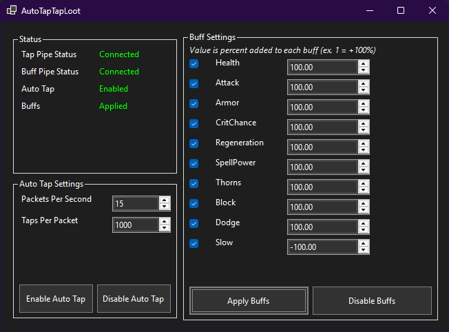

# AutoTapTapLoot
Tool for [Tap Tap Loot](https://store.steampowered.com/app/3959890/Tap_Tap_Loot/) that connects via the same pipe interface used by **The Farmer Was Replaced** and **Bongo Cat**, providing ingame auto-tap (without interfering with any other programs) and stat buffs.

## Features
- **Auto Tap** — sends tap packets to the game at a configurable rate (from *The Farmer Was Replaced*)
- **Stat Buffs** — percentage based multipliers for all in-game stats (from *Bongo Cat* item equips)

## Notes
The values you can set are effectively unlimited, thus much higher than what the other games normally provide. Set values as you see fit. Extreme values may break the game! Consider backing up your save.

## Requirements
- Tap Tap Loot running
- Bongo Cat and The Farmer Was Replaced ***not*** running. This uses the same pipes and will cause a conflict.

## Usage
1. Download latest version from [GitHub releases](../../releases)
2. Run `AutoTapTapLoot.exe`
3. Both pipes should show as **Connected** (if not, ensure you read the requirements)
4. Adjust settings and enjoy

## Settings
| Setting | Description |
|---|---|
| Packets Per Second | How many tap packets to send per second. Game only receive packets every so often, more than 10-11 or so does nothing, would leave default |
| Taps Per Packet | How many taps each packet represents, this is the main number you want to adjust |
| Buff Settings | The value is a **percentage multiplier** added to your game stats, where 1 = +100% (effectively 2x). Pressing apply only updates buffs that are currently checked. Pressing default sends a value of all zeroes to the game, effectively resetting them to unbuffed. |
